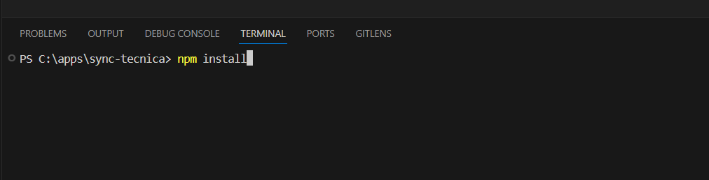
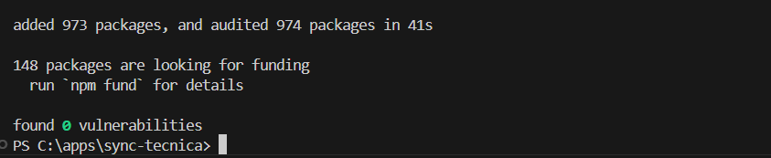
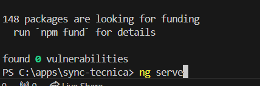
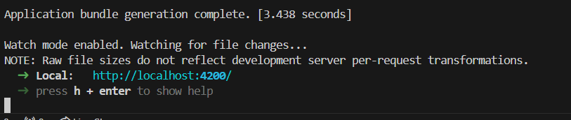
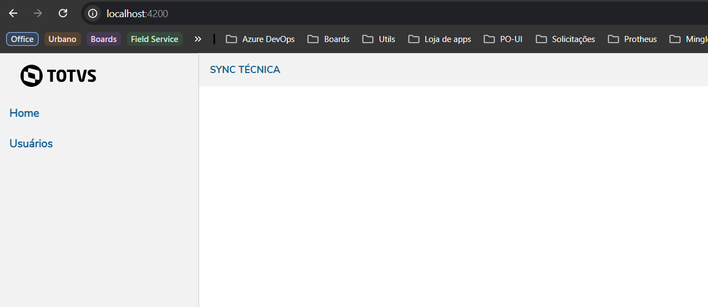

# Aqui estão alguns passos para construir sua primeira aplicação WEB utilizando Angular com PO-UI

## Pré-requisitos

Vamos começar com os pré-requisitos para uma aplicação WEB com Angular

- NVM (Node Version Manager)[Instalar NVM](./installers/NVM.md)
- Node.js [Instalar Node](./installers/Nodejs.md)
- Angular CLI [Instalar Angular CLI](./installers/Angular.md)

## Rodando uma aplicação Angular

Agora que já instalamos os pré-requisitos, vamos seguir para rodar uma aplicação Angular em nosso ambiente de desenvolvimento.

- Com o repositório aberto no VsCode abra um novo terminal com os atalhos `CTRL + '` ou `CTRL + J` e digite o comando `npm install` para instalarmos as dependências do projetos (listadas no arquivo package.json)

Instalação concluída com sucesso

- Para rodar a aplicação em ambiente de desenvolvimento, basta rodar o comando `ng serve` no terminal do VsCode

Isso irá gerar uma url local, geralmente o Angular expõe a aplicação na porta 4200 `localhost:4200`

Agora podemos ver a aplicação Angular com PO-UI e tema da TOTVS rodando no navegador

<!-- ## Iniciando uma aplicação Angular

Agora que já instalamos os pré-requisitos, vamos começar iniciando uma nova aplicação Angular.
No site do PO-UI podemos ver um guia de primeiros passos para criar uma aplicação Angular e também adicionar o PO-UI. [Primeiros passsos em POUI](https://po-ui.io/guides/getting-started)

Para criar uma nova aplicação Angular vamos começar com o comando `ng new my-po-project --skip-install` o nome 'my-po-project' é o nome da nossa aplicação e a flag '--skip-install' é para criar uma aplicação Angular nova, porém sem instalar os pacotes, ou seja, sem criar a pasta `node/modules` -->