# GIT e Gitea

Esta página tem como objetivo mostrar alguns comandos e boas práticas de git que utilizamos no dia a dia de desenvolvimento.

[Instalação do git](#instalando-git-na-sua-máquina)
[Clocando um repositório git](#clonando-um-repositório-git)

## Instalando git na sua máquina

Para instalar o git na sua máquina local, acesso o site oficial [download para windows](https://git-scm.com/download/win) selecione o download para sua máquina e bits

- Ao baixar e executar o executável do git ele pedirá permissão de adminsitrador, basta permitir e seguir a instalação clicando em 'próximo' ou 'next'

- Na seleção de componentes, deixe os componentes padrões

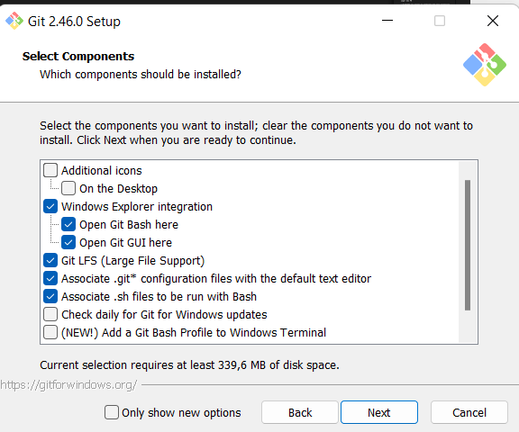

- Escolha um editor de texto de sua preferência

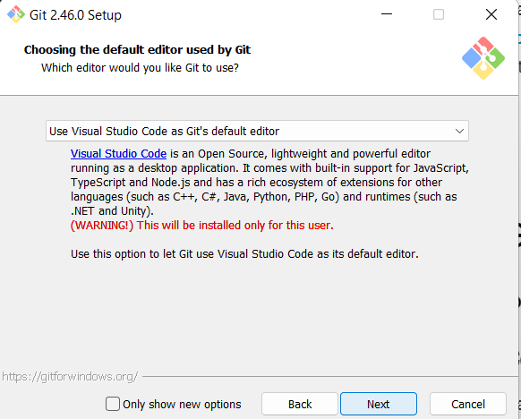

- Sobre a nomenclatura padrão da branch principal (main ou master), pode deixar a opção em que o git decide, pois geralmente o repositório criado decidirá isss.

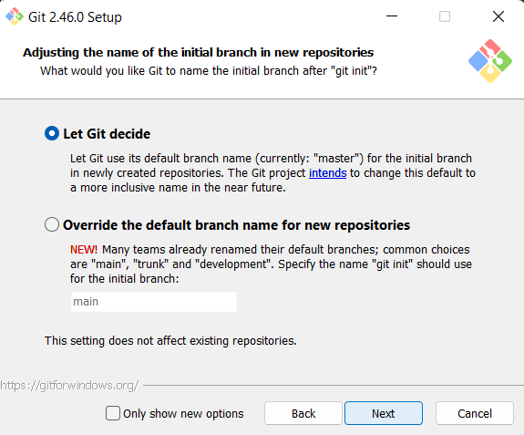

- Na parte de ajuste de variáveis de ambientes, deixe a opção recomendada

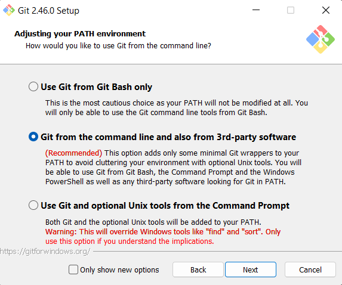

- Seguir com o SSH padrão

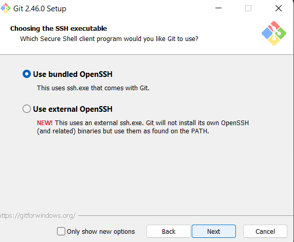

- Escolhendo a parte de transporte do HTTTPS com o padrão OpenSSL

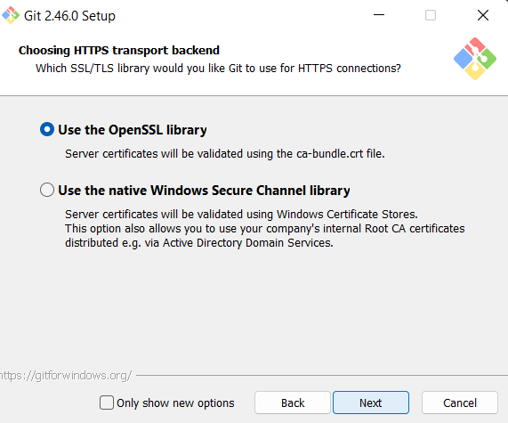

- Na configuração de fim de linhas, pode deixar a opção padrão do git

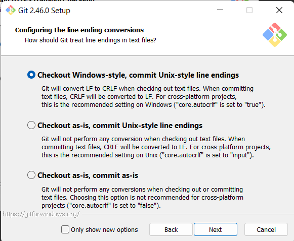

- Selecione a opção use MinTTY como terminal default ao usar git bash

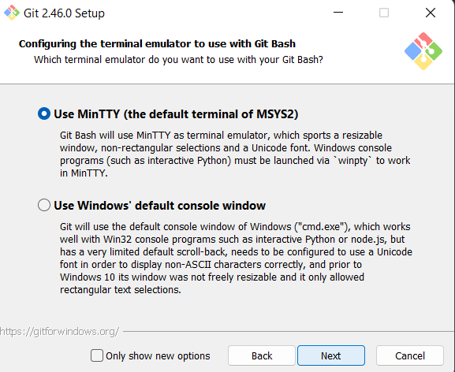

- Sobre o comportamento padrão de do git pull, escolha a opção 'Fast-forward or merge'

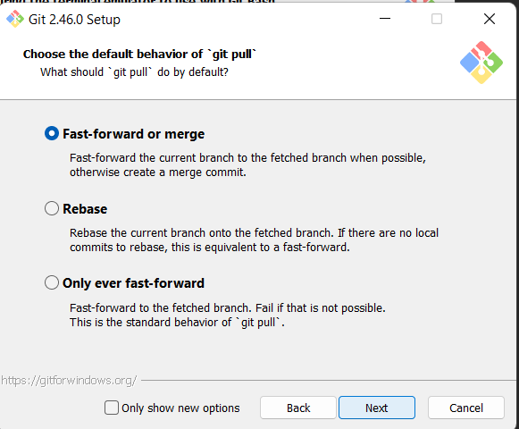

- Selecione o Git Credencial Manager como o helper de credenciais para o git

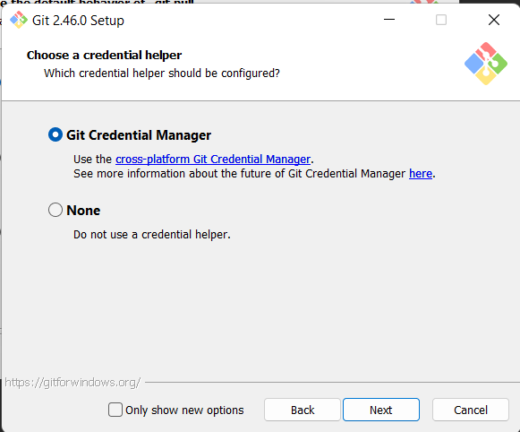

- Configurando opções extras

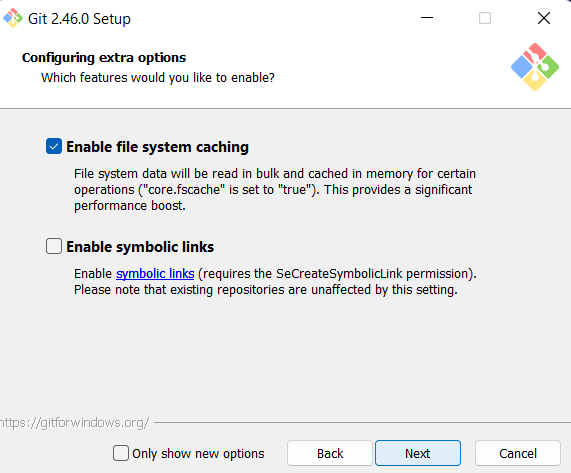

- Sobre a parte de opções experimentais pode deixar sem marcar a opção

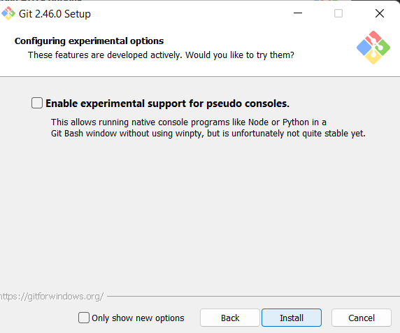

- Ao finalizar pode tirar as seleções de iniciar o git ou ver o release notes e finalizar a instalação

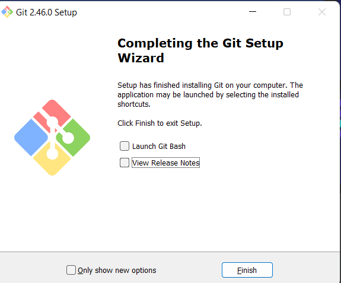

- Agora verifique se o git foi instalado, abra o prompt de comando e digite `git -v`, deve aparecer uma saída semelhante da imagem abaixo

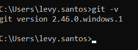

## Clonando um repositório git

Para clonarmos um repositório git, precisamos ter acesso a um repositório com pelo o menos permissão de leitura ou um repositório público

- Acesse ao [repositório de exemplo](https://github.com/levymeireles/sync-tecnica)

- Abra um prompt de comando e digite `git clone <url-do-repositorio>`, por exemplo `git clone https://github.com/levymeireles/sync-tecnica`

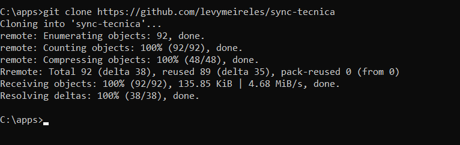

Agora com o repositório clonado, vá para o diretório do repositório clonado, uma pasta será criada a partir do diretório em que o repositório foi clonado, a pasta criada terá o mesmo nome do repositório.

- Para navegar para o diretório do repositório criado, ainda no prompt de comando digite `cd <nome-do-repositorio`, por exemplo `cd sync-tecnica`
  
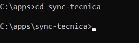

- Agora abra sua ferramente de edição de texto preferida dentro do diretório do repositório clonado, para abrir o VsCode use a variável de ambiente path `code .`, o 'code' indica que estamos chamando o VsCode e o argumento '.' indica que queremos abrir o diretório atual, ou seja, do repositório clonado no VsCode

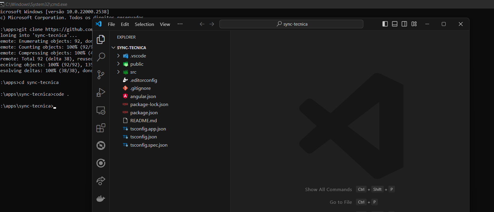

Agora com o VsCode aberto, pode fechar o terminal e usar o VsCode para trabalhar nesse repositório.

## GITEA

### Pull Request

#### Como criar um Pull Request ou PR no gitea

Para criar um pull request, abra o repositório que deseja criar a pull request no gitea

- Clique em Pull Request nas opções do repositório
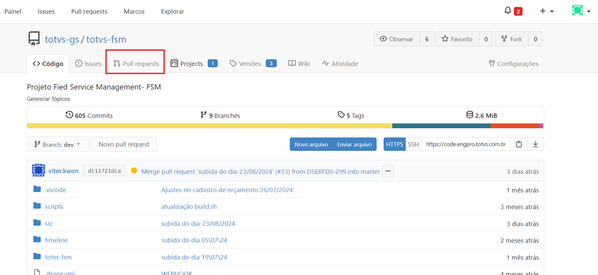

- Quando a tela abrir clique em `Novo Pull Request`
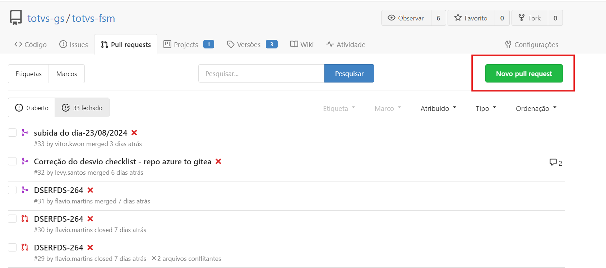

- Selecione as branchs de origem (sua branch de trabalho) e a branch de destino (branch dev do repositório geralmente). A branch de origem está com contorno vermelho e a branch de destino com contorno verde

- Clique em `Novo Pull Request` agora com as branchs já selecionadas
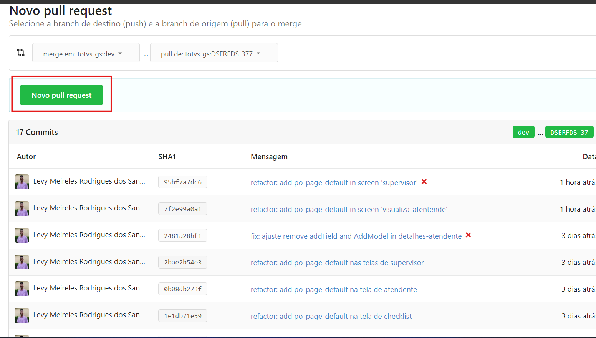

- Escreva um título e descrição para sua pull request, tente ser simples e objetivo. Fale o que vez na descrição e dê um título claro dê preferência com o código da issue no começo
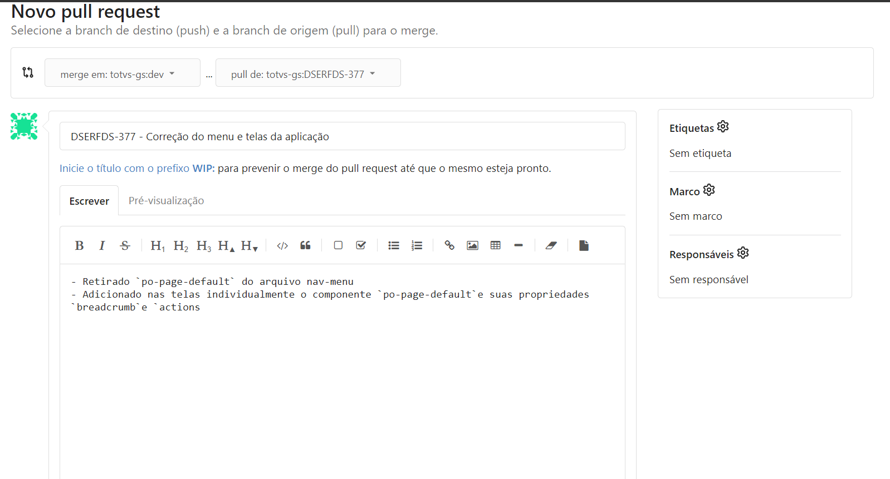

- Confirme a criação da PR simplesmente clicando em `Criar pull request`
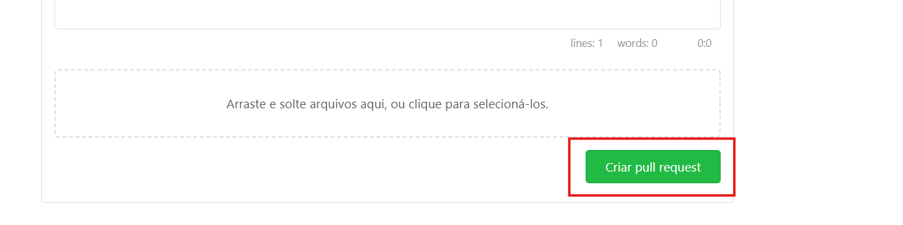

- Agora, pode visualizar sua pull request criada no menu `Pull Requests` do seu repositório
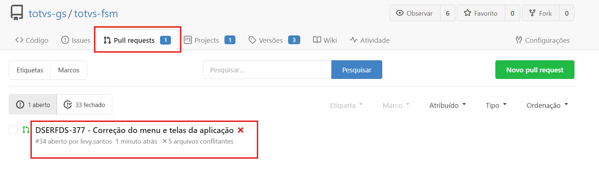

#### Como resolver um conflito de um Pull Request no gitea

Para resolver conflitos resultantes de um PR no gitea

- Dentro do seu projeto no VsCode Vá para a branch de origem do pull request `git checkout <MINHA_BRANCH_FSM0001>`

- Na branch execute o comando git `git merge origin/dev` nesse caso estamos utilizando a branch **origin/dev** como branch de comparação, ou seja, branch na qual quero jogar meu PR

- O VsCode irá acusar os conflitos que você visualizou quando pegou esse pull request para resolver. Basta resolver esses conflitos na sua máquina na branch origem do pull request, no caso do exemplo é a **MINHA_BRANCH_FSM0001**

- Após os conflitos resolvidos, tenha certeza que já commitou as mudanças com o comando `git commit`

- Agora é só subir esses novos commits para o repositório remoto `git push`

- Como já tem um PR aberto o gitea entenderá esses commits como atualizações desse PR e então não apontará mais os conflitos como existentes, já que você já resolveu eles.

- Agora só finalizar a PR pelo gitea normalmente.
