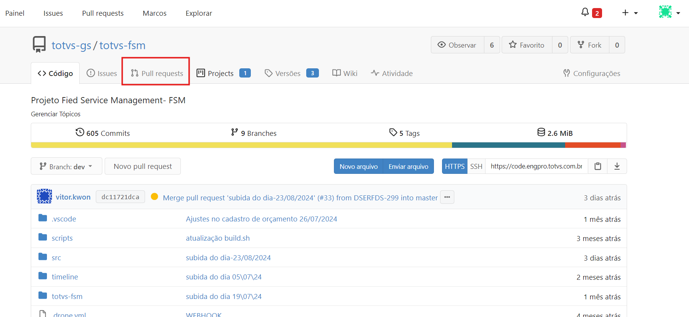
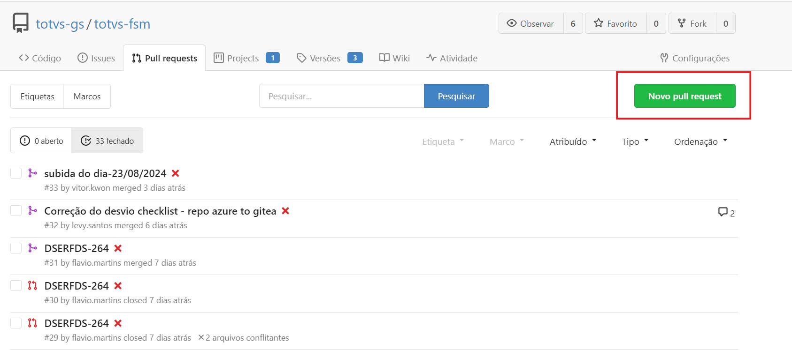
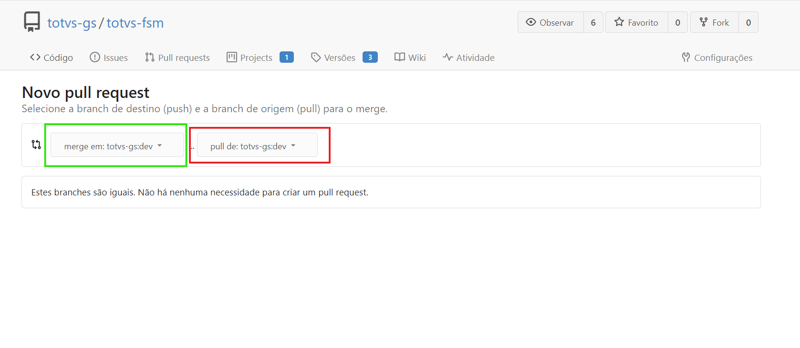
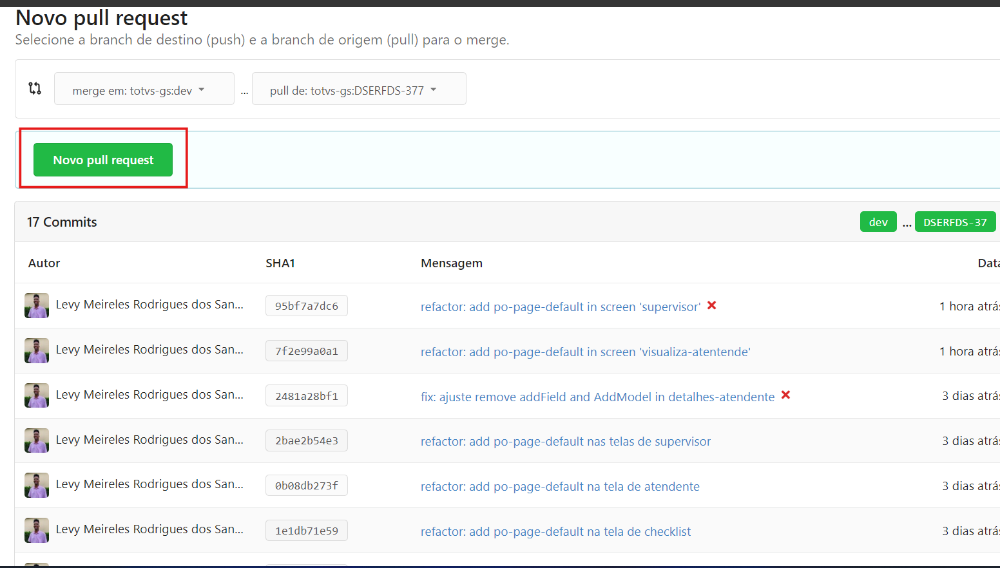
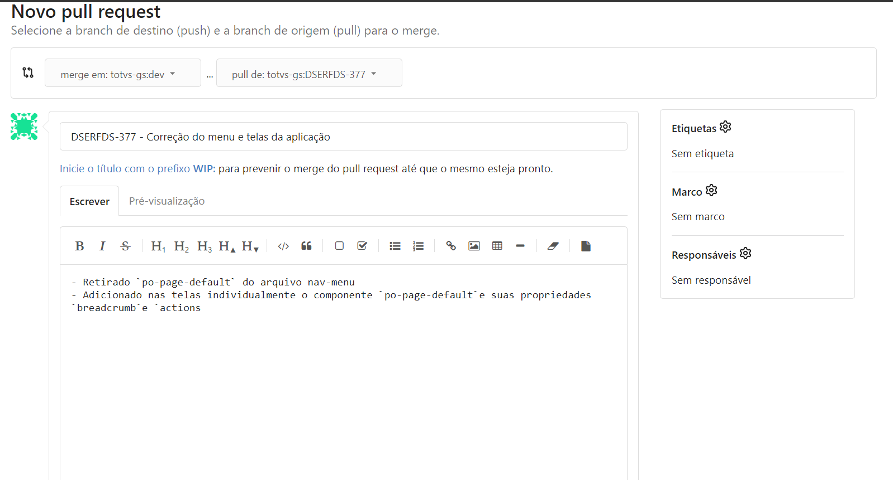
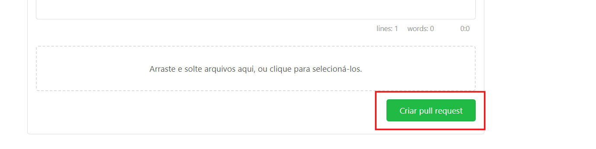

# GIT FLOW

## GITEA

### Pull Request

#### Como criar um Pull Request ou PR no gitea

Para criar um pull request, abra o repositório que deseja criar a pull request no gitea

- Clique em Pull Request nas opções do repositório

- Quando a tela abrir clique em `Novo Pull Request`

- Selecione as branchs de origem (sua branch de trabalho) e a branch de destino (branch dev do repositório geralmente). A branch de origem está com contorno vermelho e a branch de destino com contorno verde

- Clique em `Novo Pull Request` agora com as branchs já selecionadas

- Escreva um título e descrição para sua pull request, tente ser simples e objetivo. Fale o que vez na descrição e dê um título claro dê preferência com o código da issue no começo

- Confirme a criação da PR simplesmente clicando em `Criar pull request`

- Agora, pode visualizar sua pull request criada no menu `Pull Requests` do seu repositório

#### Como resolver um conflito de um Pull Request no gitea

Para resolver conflitos resultantes de um PR no gitea

- Dentro do seu projeto no VsCode Vá para a branch de origem do pull request `git checkout <MINHA_BRANCH_FSM0001>`

- Na branch execute o comando git `git merge origin/dev` nesse caso estamos utilizando a branch **origin/dev** como branch de comparação, ou seja, branch na qual quero jogar meu PR

- O VsCode irá acusar os conflitos que você visualizou quando pegou esse pull request para resolver. Basta resolver esses conflitos na sua máquina na branch origem do pull request, no caso do exemplo é a **MINHA_BRANCH_FSM0001**

- Após os conflitos resolvidos, tenha certeza que já commitou as mudanças com o comando `git commit`

- Agora é só subir esses novos commits para o repositório remoto `git push`

- Como já tem um PR aberto o gitea entenderá esses commits como atualizações desse PR e então não apontará mais os conflitos como existentes, já que você já resolveu eles.

- Agora só finalizar a PR pelo gitea normalmente.
