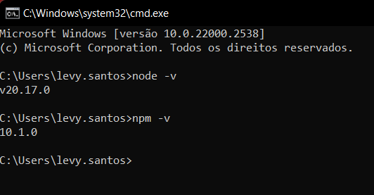

# Instalando Angular CLI

- Primeiro vamos verificar se o node e o nosso NPM foram instalados corretamente, para isso rode os comandos `node -v` e `npm -v`

- Agora vamos instalar o `angular/cli` globalmente (utilizando a flag `-b`), isso signifca que ele estará acessível em qualquer diretório da nossa máquina, para isso rode o comando `npm install -g @angular/cli`

- Pront, com tudo instalado basta verificarmos a versão do `angular/cli` para garantir que tudo deu certo, então rode o comando `ng version` para verificar a versão

Você também pode acompanhar os passos do site oficial do angular e ler a documentação do Angular pelo [Site oficial do Angular](https://v17.angular.io/cli)