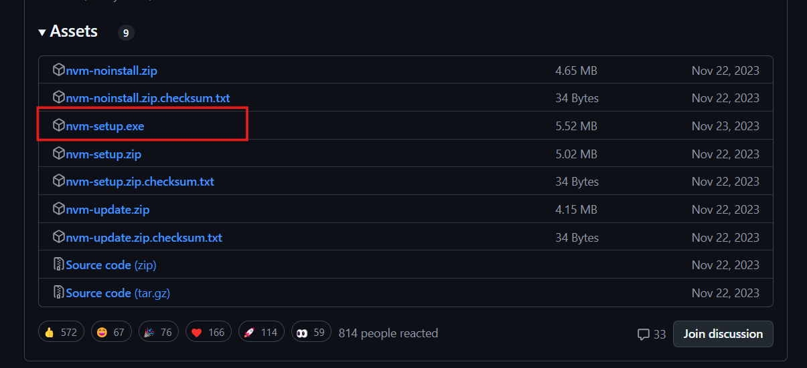
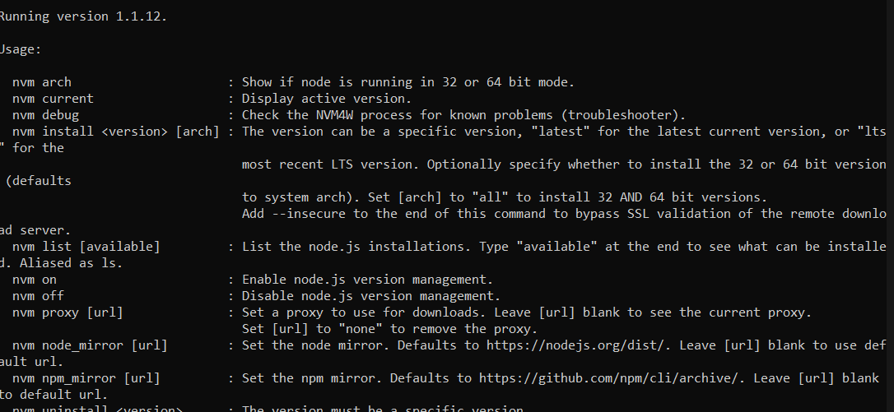
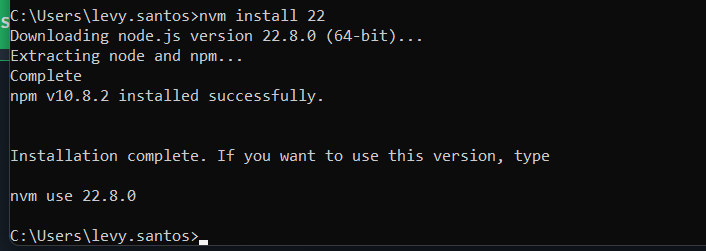
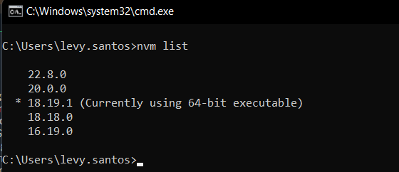
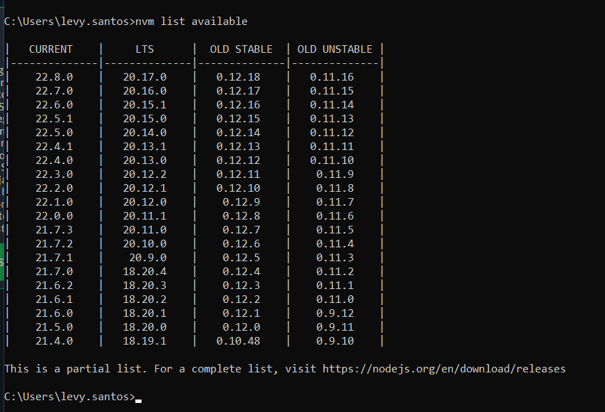
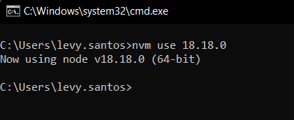
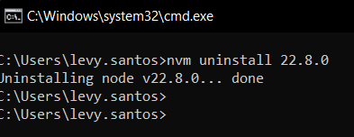

# NVM no Windows

## O que é e qual dor resolve

Como desenvolvedores de projetos que utilizam Angular e outros componentes e bibliotecas em diferentes versões. As vezes será necessário trabalhar em um projeto na qual a versão **Node** para esse projeto seja diferente da versão atual que você possui. Com isso o **NVM** resolve esse problema, sendo um gerenciador de versões de node no seu computador, podendo instalar quaisquer versões disponíveis e existentes no node, assim como mudar facildade de uma versão para outra.
[Repositório oficial do NVM](https://github.com/nvm-sh/nvm)

## Instalação

Para instalar a o NVM (Node Version Mananger) no Windows:

- Baixe o executável do NVM no seu repositório oficial [Executável do NVM](https://github.com/coreybutler/nvm-windows/releases)
- Escolha o arquivo `nvm-setup.exe`
  
- Siga o assistente de instalação, aceite os termos e clique em `next` nas próximas etapas (Não mude nenhuma configuração padrão, apenas siga clicando em 'Próximo')
- Depois de instalar o NVM, abra seu terminal do Windows ou Prompt de Comando do Windows
- Digite `nvm` e pressione `Enter` deverá aparecer uma mensagem semelhante a esta:

Agora já temos o **NVM** instalado corretamente no nossos Windows

## Comandos do NVM

### Instalar uma versão do Node com NVM

- Para instalar uma versão do node utilizando o NVM basta digitar o comando `nvm install <versionName>`no seu CMD do Windows, por exemplo `nvm install 22`, isso baixará a última versão estável do node no major 22.

### Listar suas versões do node

- Para listar as versões de node que você tem instaladas em sua máquina rode o comando `nvm list`

### Listar as versões do node disponíveis

- Para listar todas as versões disponíveis no NVM rode o comando `nvm list available` isso é semelhante a visitar o site do [nodejs.org](https://nodejs.org/en/about/previous-releases#looking-for-latest-release-of-a-version-branch)

### Utilizando uma versão do node

- Para escolher uma versão específica do node que queira usar com NVM [basta listar suas versões](#listar-suas-versões-do-node) e em seguida rodar o comando `nvm use <versionName>` por exemplo `nvm use 18.18.0`
- Nesse processo o Windows irá requerer o acesso como administrador para a mudança, basta aceitar e permitir.
- Após isso terá a versão atual como a requerida no comando anterior

### Removendo uma versão do node

- Para remover uma versão específica do node com NVM basta digitar o comando `nvm uninstall <versionName>` por exemplo `nvm uninstall 22.8.0`

## Possíveis erros e solução de problemas

### Comando não encontrado após a instalação

**Problema:** Após instalar o NVM com sucesso, você pode encontrar um problema em que a execução nvmde comandos resulta em um erro como `command not found`.

**Solução:** Isso geralmente ocorre porque o caminho do NVM não foi adicionado corretamente às variáveis ​​de ambiente do sistema. Você pode adicionar manualmente o diretório do NVM ao seu PATH:

- Clicar com o botão direito em "Este PC" ou "Meu Computador".
- Selecionando 'Propriedades'.
- Clicando em 'Configurações avançadas do sistema'.
- Na janela 'Propriedades do Sistema', clique em 'Variáveis ​​de Ambiente'.
- Na seção 'Variáveis ​​do sistema', localize e selecione a variável 'Caminho' e clique em 'Editar'.
- Adicione o caminho para sua instalação do NVM, normalmente C:\Users\<seu_usuario>\AppData\Roaming\nvm.
Clique em 'OK' para salvar suas alterações e fechar todas as janelas restantes.

### O instalador não consegue definir as variáveis de ambiente

**Problema:** Às vezes, mesmo que a instalação seja concluída com sucesso, o NVM pode não funcionar porque o instalador falha ao definir as variáveis ​​de ambiente necessárias.

**Solução:** Verifique se as variáveis ​​de ambiente foram definidas corretamente. Se não, adicione manualmente `NVM_HOME` e `NVM_SYMLINK` às variáveis ​​de ambiente do seu sistema:

- `NVM_HOME` deve apontar para o diretório onde o NVM está instalado.
- `NVM_SYMLINK` deve apontar para o diretório onde as instalações do Node serão colocadas.
Certifique-se de adicioná-los também à variável 'Path', conforme descrito acima.

### Acesso negado durante a instalação

**Problema:** A instalação falha com uma mensagem de erro 'Acesso Negado'.

**Solução:** Isso pode ocorrer se você não tiver privilégios administrativos no seu computador. Tente executar o instalador como administrador clicando com o botão direito do mouse no instalador e selecionando 'Executar como administrador'.

### Problemas com a instalação de versões específicas do Node

**Problema:** Após a instalação do NVM, a tentativa de instalar certas versões do Node falha.

**Solução:** Isso pode acontecer devido a problemas de rede ou se a versão do Node especificada estiver incorreta. Certifique-se de ter uma conexão de internet estável e verifique o número da versão. Além disso, tente instalar outra versão para verificar se o problema é específico de uma versão. Às vezes, executar o prompt de comando como administrador ajuda.

### nvm não é reconhecido como um comando interno ou externo

**Problema:** Esse erro geralmente aparece se o prompt de comando foi aberto durante a instalação e não foi reiniciado, ou o PATH não foi atualizado corretamente.

**Solução:** Feche e reabra o prompt de comando ou reinicie o computador para garantir que todas as alterações ambientais entrem em vigor. Verifique novamente as configurações do PATH conforme descrito nas soluções para 'Erro de comando não encontrado após a instalação'.

### Incapacidade de alternar versões de node

**Problema:** O NVM instala e lista as versões do Node corretamente, mas alternar entre elas não parece funcionar.

**Solução:** Certifique-se de que, ao instalar as versões do Node via NVM, você esteja executando o prompt de comando como administrador. Às vezes, problemas de permissão podem impedir que o NVM modifique os links simbólicos corretamente.

### Desempenho lento no Windows

**Problema:** Às vezes, o NVM pode ser visivelmente mais lento no Windows em comparação aos sistemas Unix.

**Solução:** Este é um problema conhecido devido à forma como as variáveis ​​de ambiente e os caminhos são gerenciados no Windows. Minimizar o número de versões do Node instaladas e reinicializar o sistema após fazer alterações significativas pode ajudar às vezes.
