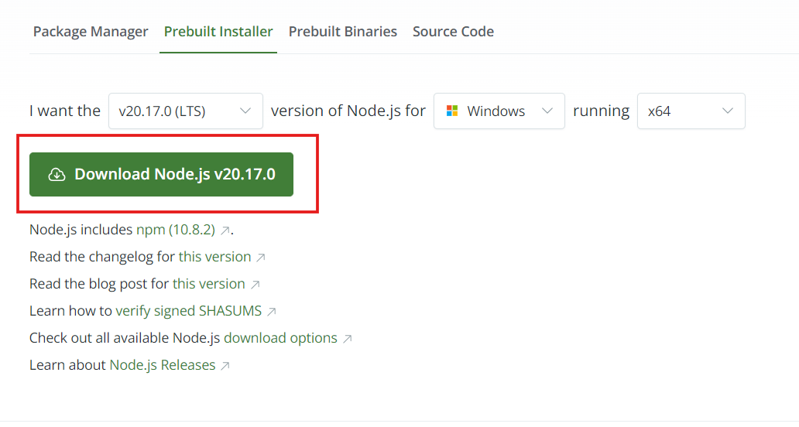
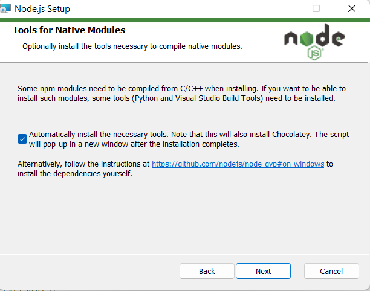
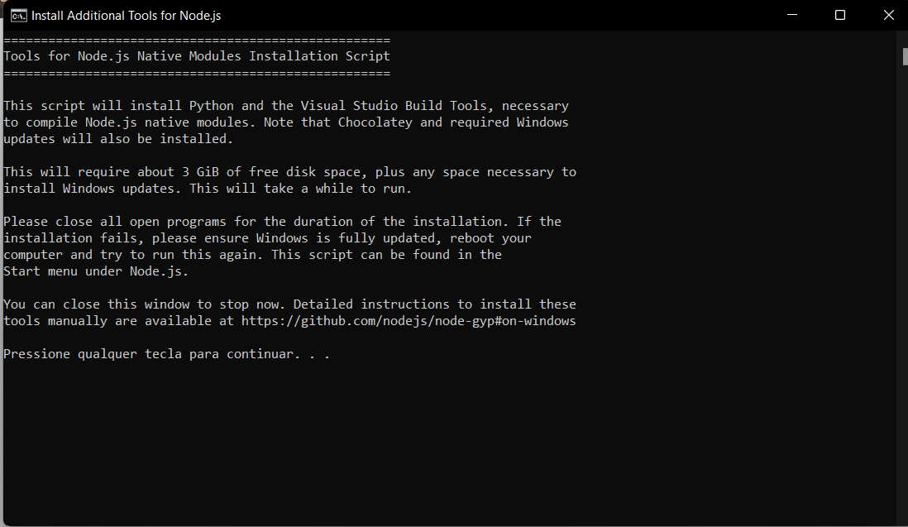
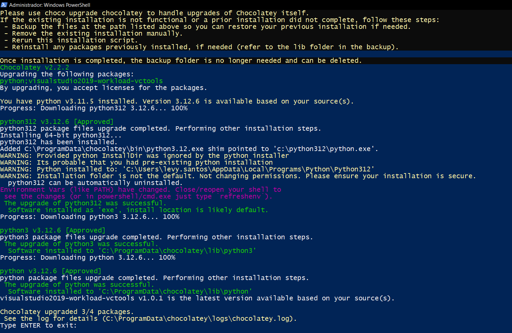
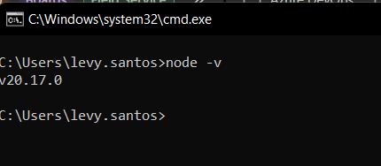

# Instalando NODE no Windows

Para instalar o Node no windows existem duas formas:
- Pode seguir a instalação utilizando o NVM como mostra em: [Instalando node com NVM](NVM.md#instalar-uma-versão-do-node-com-nvm)
- Ou pelo site oficial do [Nodejs.org](https://nodejs.org/en/download/prebuilt-installer)

Para instalar pelo site oficial do node siga os seguintes passos:

- Baixe o instalador do [Nodejs.org](https://nodejs.org/en/download/prebuilt-installer)
- Clicando em:

- Após baixar o instalador execute o instalador e siga os passos confirmando e clicando em `next` nos próximos passos.
- Um dos passos irá perguntar se deseja baixar as outras ferramentas e recursos necessários para o node funcionar, pode aceitar e continuar a instalação com `next` ou `Próximo` nos demais passos.

- Caso peça autorização como administrador, aceite e continue a instalação.
- Ao finalizar ainstalação, abrirá um prompt de comando que pedirá que pressione qualquer tecla para instalar os complementos que você autorizou acima:

- No final da instalação dos componentes adicionais o powershell irá pedir que aperte a tecla `Enter`para finalizar a instalação

Para validar sua instalação, abra um novo prompt de comando e execute o comando `node -v` para visualizar sua atual versão do nodejs, se aparecer um resultado semelhante a imagem abaixo, está tudo certo e o node foi corretamente instalado na sua máquina

